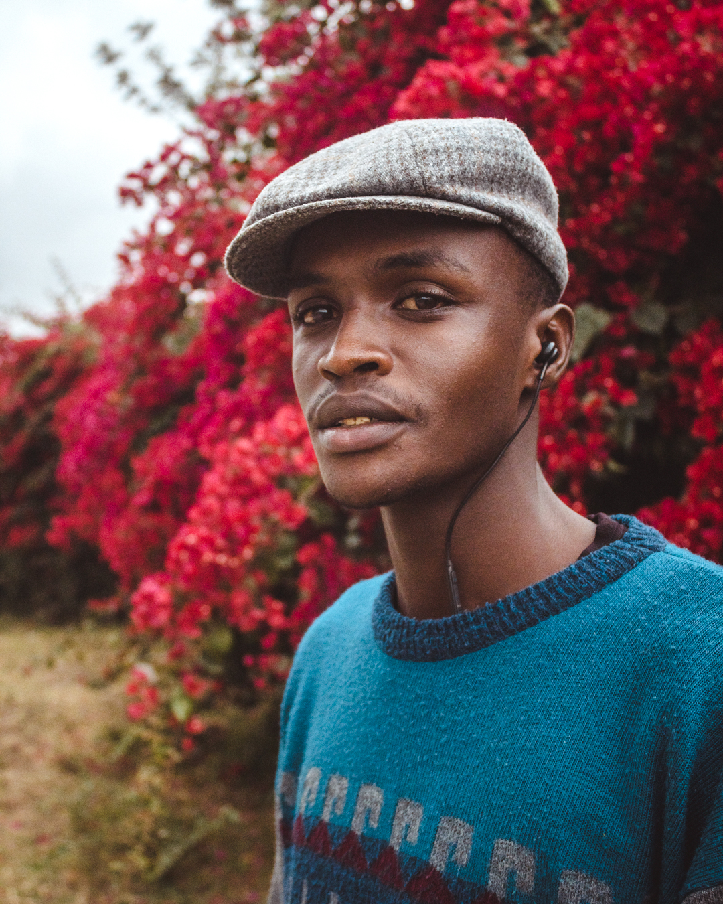

# Napconic-Photoboking-website
this project is a webiste that enables users to visit my webpage.
// the nav bar 
<!DOCTYPE html>
<html>
  <head>
    <title>Napconic Visuals</title>
    <link rel="stylesheet" href="https://cdnjs.cloudflare.com/ajax/libs/font-awesome/6.4.2/css/all.min.css" integrity="sha512-z3gLpd7yknf1YoNbCzqRKc4qyor8gaKU1qmn+CShxbuBusANI9QpRohGBreCFkKxLhei6S9CQXFEbbKuqLg0DA==" crossorigin="anonymous" referrerpolicy="no-referrer" />
    <link rel="stylesheet" href="css style.css" />
    
  </head>
  <body>
    

      

        

        

          <nav>
            <ul>
              <li><a href="#home" class="btn"> Home</a></li>
              <li><a href="#services"  class="btn"> Services</a></li>
              <li><a href="#contact" class="btn"> Contact</a></li>
              <li><a href="#about" class="btn"> About</a></li>
            </ul>
          </nav>
        

      

    

    

      Home
//the body 
<h1>Hi , We're  </h1>
      <h2>Napconic</h2>
      <a href="//instagram.com/napconic">
        <button class="view-btn">View Portfolio</button>
      </a>
      <a href="http://localhost/login/login.php">
        <button class="wwu-btn">Work with us</button>
      </a>
      <!--HERE IS WHERE I ADDED A ROW OF PHOTOS-->
      

        <article class="card">
          <figure>
          
        <figcaption>
          <h3> At the UON bridge potrait</h3>
        </figcaption>
          </figure>
          </article>
          <article class="card">
            <figure>
              
              <figcaption>
                <h3> On the street potrait</h3>
              </figcaption>
            </figure>
          </article>
        <article class="card">
          <figure>
            
          <figcaption>
            <h3> Matwana Potrait</h3>
          </figcaption>
          </figure>
        </article>
        <article class="card">
          <figure>
            
            <figcaption>
              <h3> Boy in Spring time</h3>
            </figcaption>
          </figure>
        </article>
      

      <!--i shall write the services section here-->
      <section>
        

  <h3> Services</h3>
  

  

  
  
<h4> Potrait  Photography</h4>

 We offer potrait sessions

  

    

      </section>
    <!--i shall write down the Contact section here-->
    <section>
     
      

  <h3>Contact Us</h3>
  

    

      
<i class="fa fa-map-marker" aria-hidden="true"></i>

      

        <h4>Address</h4>
        
 Eden Court Utawala

        

    

    

      
<i class="fa-solid fa-phone"></i>
      

      

        <h4>Phone</h4>
        
0789029604

    

    

    

      
<i class="fa fa-envelope" aria-hidden="true"></i>
      

      

        <h4>Email</h4>
        
bugahpaulo@gmail.com

        

        

        

          
<i class="fa-brands fa-instagram"></i>
          

          

           <h4>Instagram</h4>
         <a class="social-icon" href= "https://instagram.com/napconic">
          <h5>Instagram</h5> </a> 
          
        </a>

        

    

  

    </section>
    <!--this section will have the services we o-->
    <!--this section will have the about-->
    <section>
     
      

        

          

            

              

                <h2> Napconic</h2>
                
Freelance Photographer / Filmmaker , Nairobi. 

              

              

                <h2>Freelancer</h2>
                
 I am a profesional Photographer and filmmaker based in Nairobi,Kenya. 

                
 I started photography after High school and i had planned to do this, 
                  because i really liked when i saw my fellow classmates having good pictures of themselves, 
                  that had been taken by Professional photographers. 

                  
It has proved to be a good source of income from my talents as people do apprecite my work.

            

          
   

      

    </section>

  </body>
</html>

// css for this webpage 
* {
    margin: 0%;
    padding: 0%;
}

body {

    background-image: url(LOGOS/IMG_3833.jpg);
    background-attachment: fixed;
    background-repeat: no-repeat;
    background-position: center;
    background-size: cover;
    height: 100vh;
    width: 100%;

}

section {
    min-height: 100vh;
    display: flex;
    justify-content: center;
    align-items: center;
    width: 100%;
    color: #ffffff;
}

button {
    background: linear-gradient(45deg, #e7eff9, #cfd6e6);
    padding: 6px 44px;
    margin-left: 300px;
    display: inline-block;
    justify-content: center;
    border: none;
    border-radius: 75px;
    transition: all 0.4s ease 0s;
    font-size: 13px;
    position: relative;
    top: -79px;
}

.wwu-btn:hover {
    background: #000000;
    color: #cfd6e6;
    cursor: pointer;
    transform: scale(1.3);
}

.view-btn:hover {
    background: #000000;
    color: #cfd6e6;
    cursor: pointer;
    transform: scale(1.3);
}

.gallery {
    display: flex;
    gap: 13px;
}

.card {
    position: relative;
    left: 66px;
    bottom: 36px;
    width: 260px;
    height: 280px;
    border-radius: 12px;
    transition: 1000ms all;
    transform-origin: centre left;
    outline: 8px;
    overflow: hidden;
}

.card img {
    height: 280px;
    object-fit: cover;
    border-radius: 4px;
}

.card:hover {
    cursor: pointer;
    transform: scale(1.15);
}

.card:hover figcaption {
    font-size: 0.6rem;
    position: absolute;
    height: 80px;
    width: 160px;
    display: flex;
    align-items: end;
    color: azure;
    left: 0px;
    bottom: 0px;
    padding-left: 12px;
    padding-bottom: 10px;
}

.card:hover~.card {
    font-weight: bold;
    cursor: pointer;
    transform: translateX(22px);
}

#Contact {
    font-size: larger;
    color: #ffffff;

}

.container1 {
    width: 100%;
    top: 0;
    left: 0;
    height: 5vh;
    padding: 20px 100px;
    background-color: transparent;
    background-color: #cfd6e6;
    display: flex;
    position: fixed;
    justify-content: space-between;
    z-index: 100;

}

.container3 {
    width: 100%;
    top: 0;
    left: 0;
    padding: 20px 100px;
    font-size: 23px;
    background-color: transparent;
    z-index: 100;
}

.container3 h3 {
    text-align: center;
    color: #cfd6e6;
}

.container3 h3::after {
    content: '';
    display: block;
    height: 3px;
    width: 170px;
    background: #008000;
    margin: 20px auto 50px;
}

.services p {
    font-size: 15px;
    margin-top: 10px;
    color: #fff;
    padding: 20px;
}

.services .col-md-3:hover {
    background: linear-gradient(45deg, #e7eff9, #cfd6e6);
    cursor: pointer;
    box-shadow: -5px 5px 10px 0 rgba(0, 0, 0, 0.4);
    transition: -5s;
}

.card1 {
    width: 300px;
    height: 433px;
    margin-right: 562px;

    margin-bottom: 54px;
}

.card1:hover .card-inner {
    transform: rotateY(180deg);
}

.card-inner {
    width: 100%;
    height: 100%;
    position: relative;
    transition: transform 1s;
    transform-style: preserve-3d;
}

.front,
.back {
    width: 100%;
    height: 100%;
    border-radius: 15px;
    backface-visibility: hidden;
    position: absolute;
}

.front {
    background: url(LOGOS/Canon\ EOS\ 4000D\ 1440x1920_000164.jpg);
    background-size: cover;
    background-position: center;
    padding: 50px 40px;
    display: flex;
    justify-content: flex-end;
    flex-direction: column;

}

.back {
    background: url(LOGOS/camera1.jpg);
    justify-content: flex-end;
    display: flex;
    padding: 40px 40px;
    background-size: cover;
    background-position: center;
    flex-direction: column;
    transform: rotateY(180deg);
}

.front h2 {
    font-weight: 500;
    margin-bottom: 7px;
    margin-left: -122px;
}

.front p {
    color: #fff;
    font-size: 13px;
}

.back h2 {
    font-weight: 120;
    margin-bottom: 7px;
    margin-top: -122px;

}

.navbar {
    width: 100%;
    height: 7vh;
    display: flex;
    margin: auto;
    align-items: center;

}

.logo {
    position: absolute;
    height: auto;
    width: 220px;
    left: 0px;
    cursor: pointer;
}

a {
    text-decoration: none;
    color: #000000;
}

h1 {
    text-align: center;
    padding-top: 36px;
    font-size: 65px;
    margin: 20px 0px 20px;
    color: #f6f6f6;
}

span {
    color: #f9e665;
}

h2 {
    text-align: center;
    margin: 20px 10px 80px;
    color: #ffffff;
    font-size: 45px;

}

.container2 h3 {
    color: #ffffff;
    width: 100%;
    font-weight: 300;
    display: flex;
    position: left;
    margin-top: 60px;
    margin-left: -366px;
    font-size: 50px;
}

.container2 .ContactInfo {
    width: 100%;
    height: 100%;
    flex-direction: column;
    display: flex;
}

.container2 .ContactInfo .box {
    position: relative;
    padding: 20px 50px;
    display: flex;
}

.container2 .ContactInfo .box .icon {
    min-width: 50px;
    height: 50px;
    background: #7951AB;
    display: flex;
    justify-content: center;
    align-items: center;
    border-radius: 50px;
    font-size: 32px;
}

.container2 .ContactInfo .box .text {
    display: flex;
    margin-left: 20px;
    font-size: 22px;
    color: #fff;
    flex-direction: column;
    font-weight: 300;

}

.container2 .ContactInfo .box .text h4 {
    font-weight: 300;
    color: #f9e665;
}

.social-icon {
    color: #fff;
}

nav {

    padding-left: 100px;
    flex: 1;
}

nav ul li {
    display: inline-block;
    list-style: none;
    margin: 0px 20px;

}

nav ul li a {
    position: relative;
    text-decoration: none;
    font-size: 16px;
    font-weight: 700;
    color: #000000;
    margin-left: 80px;
}

.navbar a::before {
    content: '';
    position: absolute;
    top: 100%;
    left: 0;
    width: 0;
    height: 3px;
    background: #fff;
    transition: .3s;
}

.navbar a:hover:before {
    width: 100%;
}

.contact {
    position: relative;
    min-height: 100vh;
    padding: 50px 100px;
    display: flex;
    justify-content: center;
    flex-direction: column;
}

.content {
    margin-left: 1%;
    margin-top: 1%;
}

content p {
    font-size: 30px;
    color: black;
}
// i further went ahead and created a database in order to create availability for a potential client to book our services.
the code is not included here.
